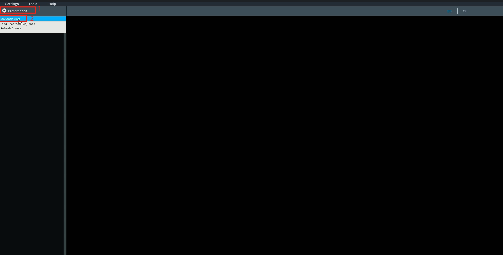
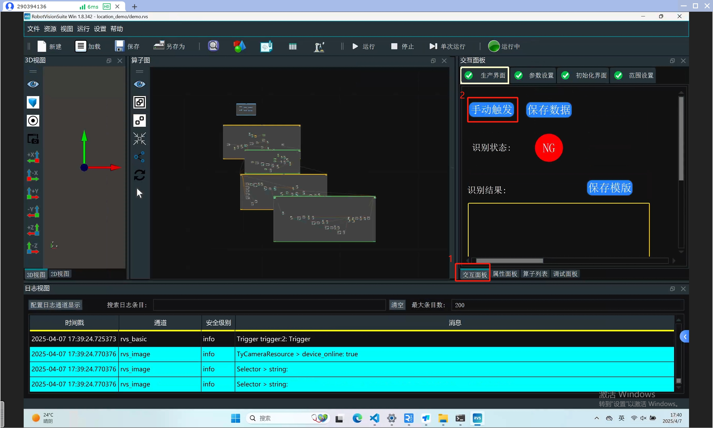
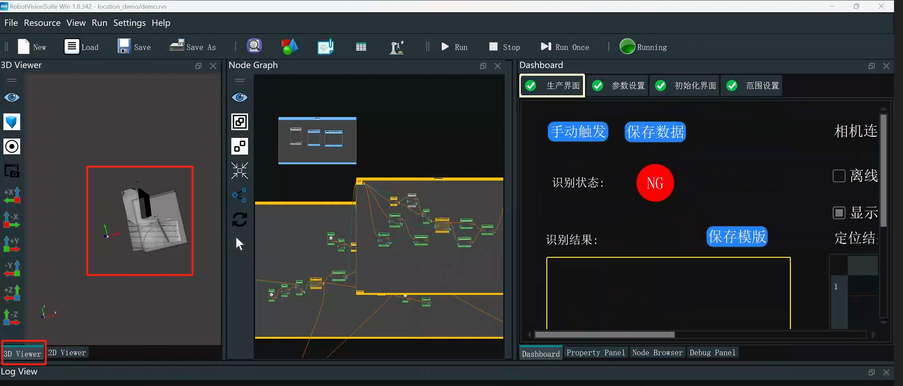

# 3 Unit Test

## 3.1 Robotic Arm & Suction Pump Test

Select the wifi hotspot you want to connect to, enter the password to connect, and check the wireless IP of the robot. The computer used by the customer must be connected to the same wifi hotspot as the robot. Open vnc, enter the wireless IP of the robot, username and password

Just move the mouse to the WiFi icon to display the wireless IP

Run the test.py file in the demo_code folder in the location_demo folder. After the robot returns to the zero position of the joint, turn on the suction pump for 2 seconds and then turn it off

**Note**:
robot_ip should be changed to the actual wireless IP of the robot

## 3.2 Camera Test

Please refer to the camera debugging section in the video tutorial: https://www.youtube.com/watch?v=Dc6DFPx4O8E
**Video chapter time node**: 1 minute 44 seconds to 2 minutes 46 seconds

Change the IP of the wired network card connected to the camera to automatic allocation

Open the camera parameter adjustment software and connect the camera

First click the color image and depth image acquisition button of the camera, then click the color point cloud mode, adjust the camera's gain parameters, and adjust them according to the actual situation. The parameters in the Left lR Stream and the Right IR Stream should be adjusted to be consistent. The point cloud adjustment and the effect in the picture are fine. After adjustment, be sure to turn off the camera parameter adjustment software

**Notes**: After each power-on of the camera, the camera parameters need to be readjusted to ensure the imaging quality of the point cloud

<!-- ## 3.2 Camera test

Double-click the RVS icon on the desktop, wait for RVS to open, and click Load

Then select the demo.rvs file in the location_demo folder

Then click Run

Wait for the camera to initialize

 

After the camera is initialized successfully, click the interactive panel, and then click Manual Trigger

Just output the image

 -->
