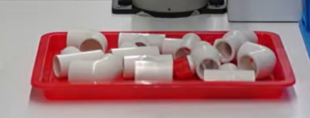
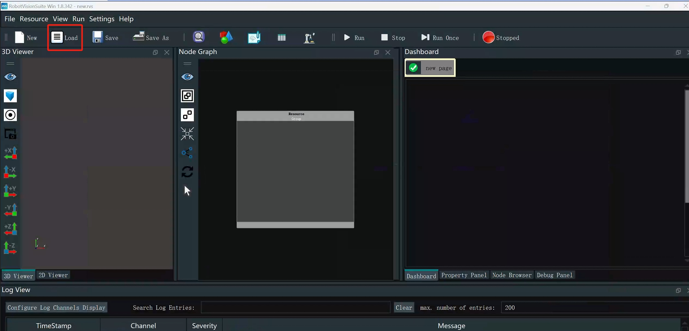
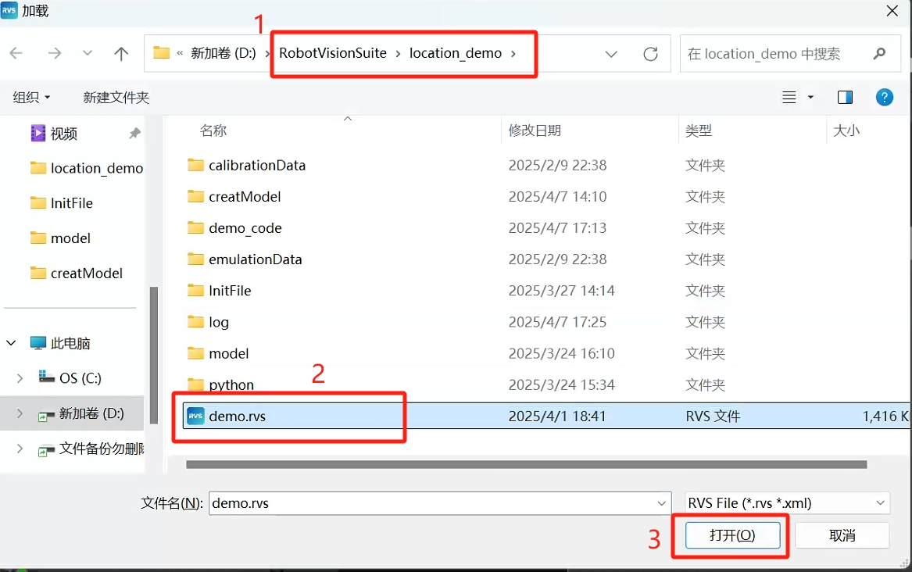
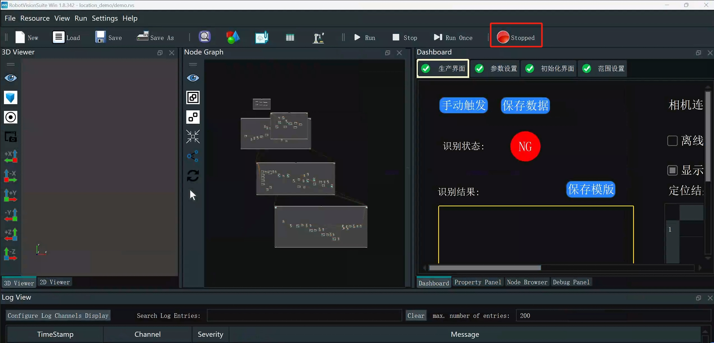
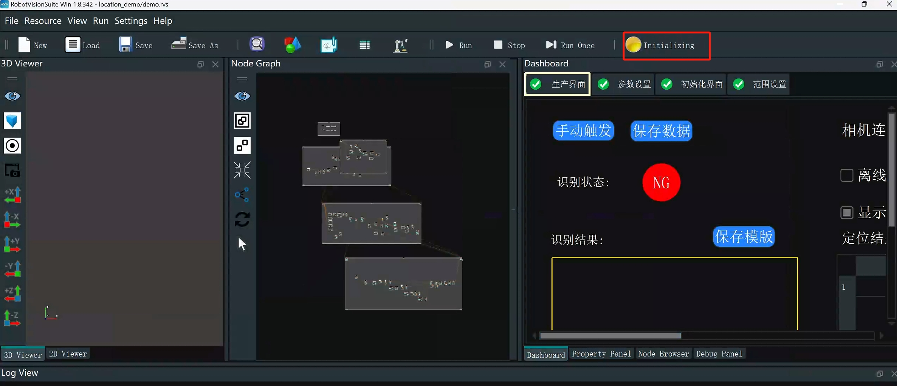
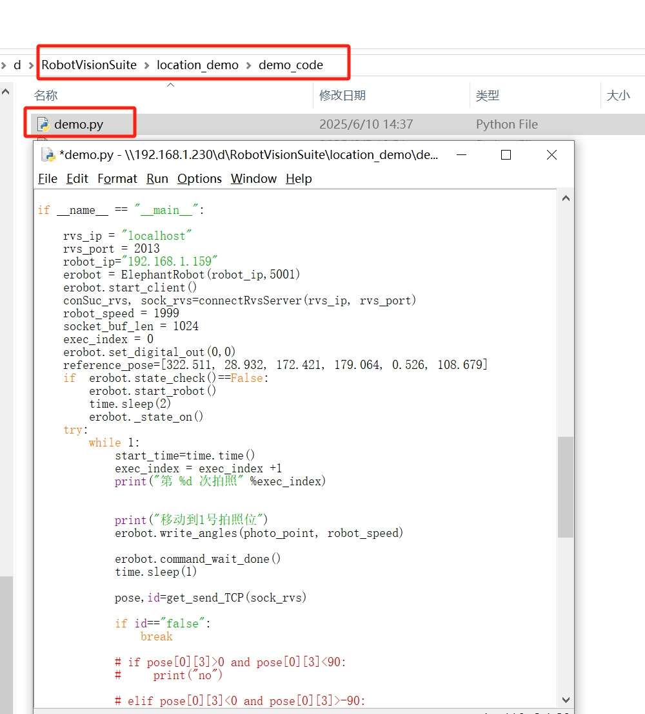
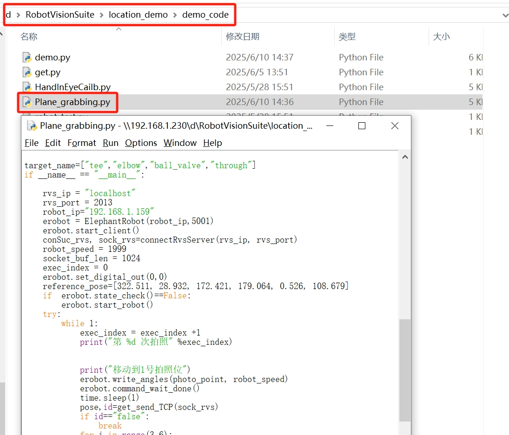

## 5 Case reproduction

Please refer to the capture demonstration section in the video tutorial: https://www.bilibili.com/video/BV1xxTNzxEL2/?spm_id_from=333.337.search-card.all.click&vd_source=672e3f7240eaaca210b45e7c033dc45f

**Note**: Point cloud templates have been created for 4 types of PVC workpieces. Users do not need to create them again and can use them directly

## 5.1 Workpiece placement
Place the PVC workpieces in the tray. The workpieces cannot be stacked and must be placed flat

## 5.2 Six-degree-of-freedom grasping case

**Case description**: The six-degree-of-freedom grasping case effect is grasping with posture, that is, the posture of the end of the robot arm during grasping will not be completely consistent with the posture of the end of the robot arm at the photo position

Double-click the desktop RVS icon, wait for RVS to open, and click Load

Then select the demo.rvs file in the location_demo folder

Then click Run

Wait for the camera to initialize

 

Run the demo.py file in the demo_code folder in the location_demo folder

**Note**:
robot_ip should be changed to the actual wireless IP of the robot arm

## 5.3 Plane Grabbing Case
**Case Description**: The six-degree-of-freedom grabbing case effect is without posture grabbing, that is, the posture of the end of the robot arm during grabbing will be completely consistent with the posture of the end of the robot arm at the photo position

Double-click the desktop RVS icon, wait for RVS to open, and click Load

Then select the Plane_grabbing.rvs file in the location_demo folder

Then click Run

Wait for the camera to initialize

 

Run the Plane_grabbing.py file in the demo_code folder in the location_demo folder

**Note**:
robot_ip should be changed to the actual wireless IP of the robot

## 5.4 Precautions

After the program is running, after the camera returns to the shooting position, the workpiece cannot be placed in the tray in the middle to avoid the risk of misidentification by the camera and collision of the robot arm.