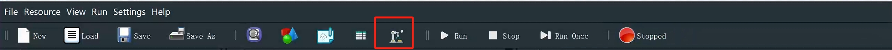
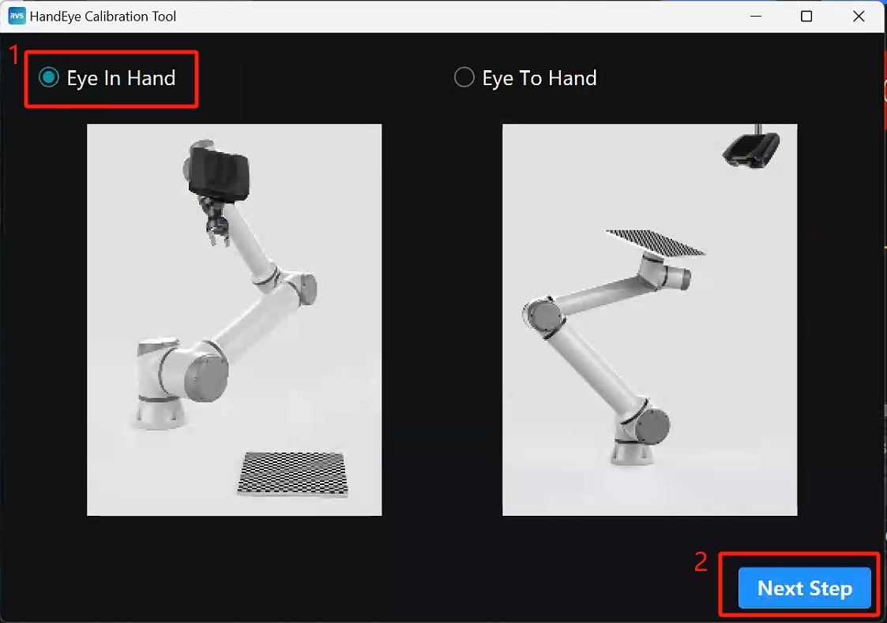
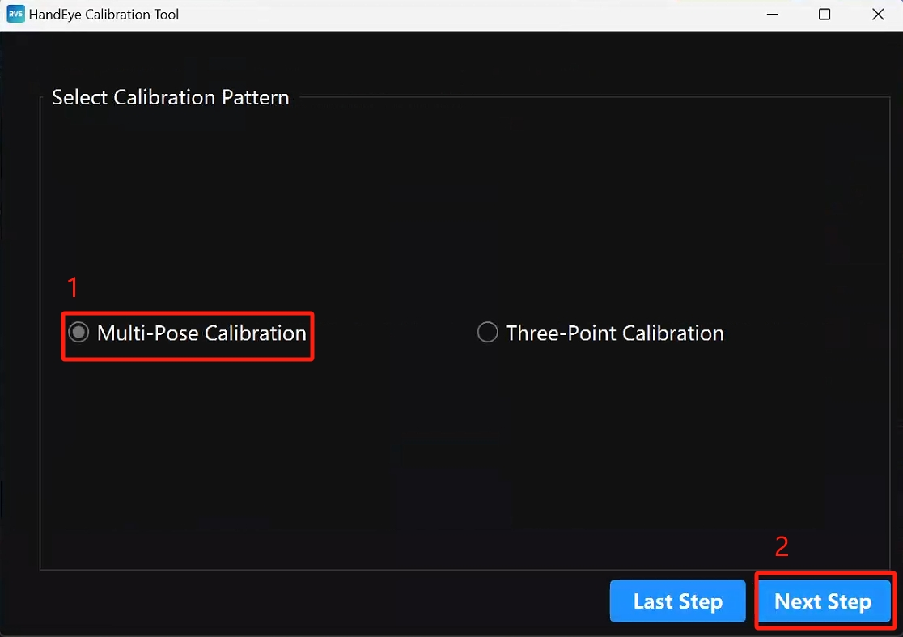
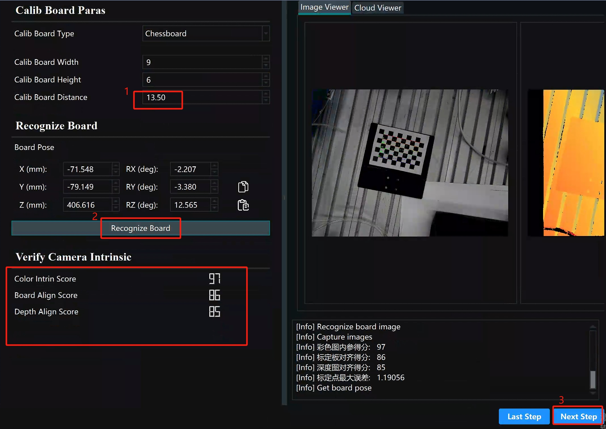
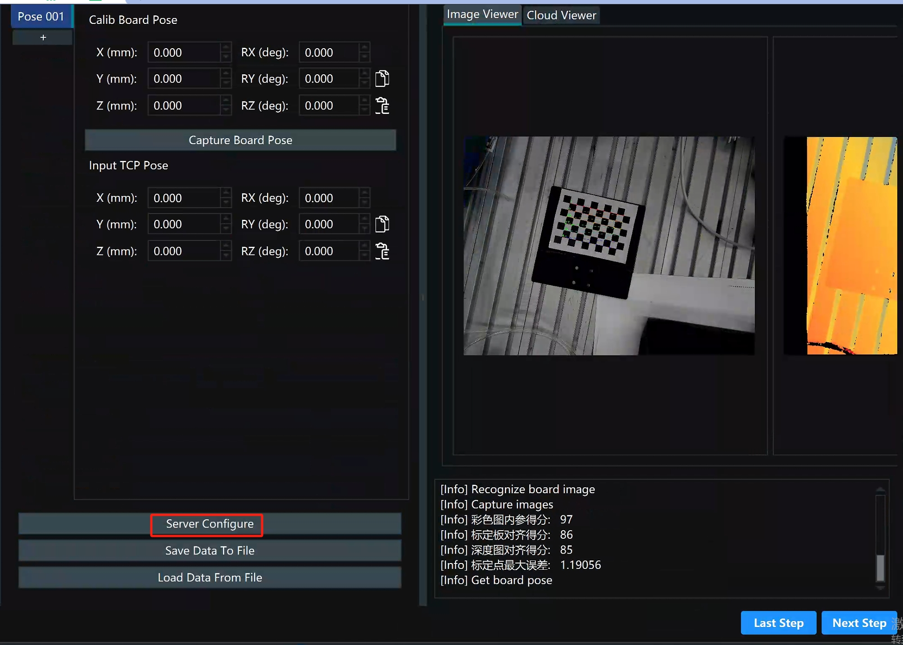
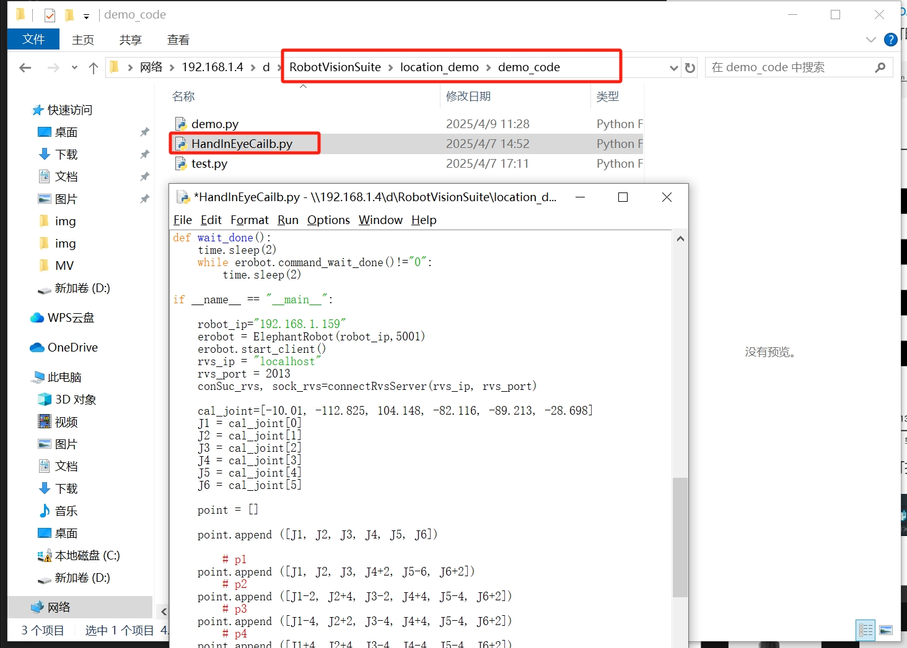
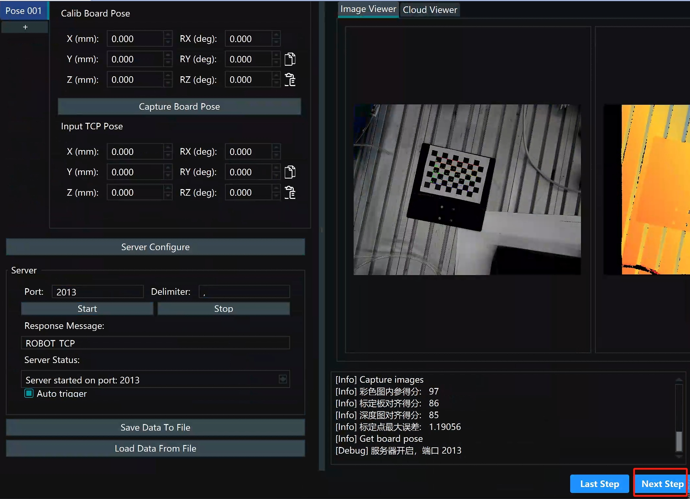

# 5 Hand-eye calibration

Please refer to the hand-eye calibration section in the video tutorial:https://www.bilibili.com/video/BV1xxTNzxEL2/?spm_id_from=333.337.search-card.all.click&vd_source=672e3f7240eaaca210b45e7c033dc45f

Calibration board generation website: https://calib.io/pages/camera-calibration-pattern-generator
You can set it according to the image parameters and print it out with a printer

Click the hand-eye calibration tool in the menu bar to open the hand-eye calibration tool window

Select Eye on Hand and click Next

Select multi-pose calibration and click Next

Select six-axis robot and click Next

Follow the instructions in the installation picture, click the buttons in sequence, and after clicking the button and the log is output, proceed to the next step. Try to place the calibration disk in the center of the field of view to ensure that the robotic arm can fully capture the calibration plate after each movement

Fill in the calibration plate spacing according to the side length of a grid on the calibration plate, click to identify the calibration plate, and after the score is output, click Next

Click on the communication service configuration

According to the image annotation, click the buttons one by one

Run the HandInEyeCailb.py file in the demo_code folder in the location_demo folder. After running the program, the calibration board must not be moved

After the program ends, click Next, click Calculate Calibration Results, and after the results are output, click Save Calibration Results and save them to the InitFile folder in the location_demo file

 

 

